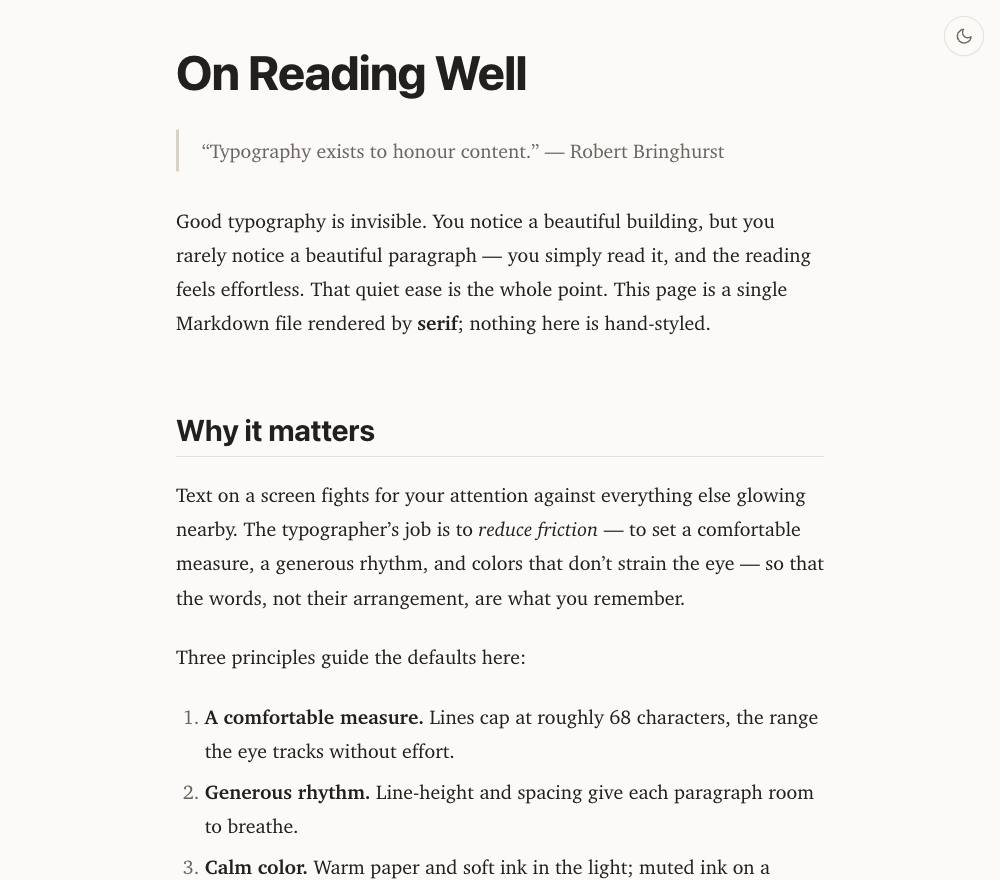
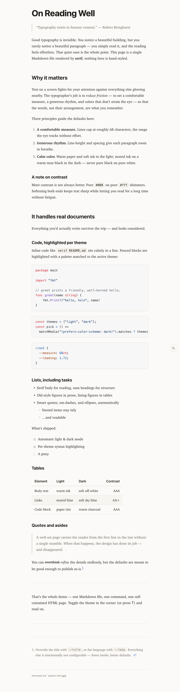
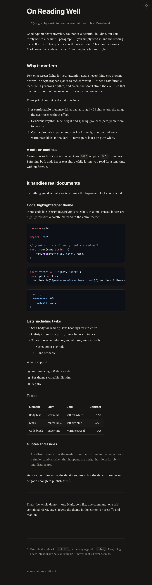

<h1 align="center">serif</h1>

<p align="center"><em>Turn Markdown into a beautifully typeset, self-contained HTML page.</em></p>

<p align="center">
  <a href="https://github.com/tristanMatthias/serif/actions/workflows/ci.yml"></a>
  <a href="https://github.com/tristanMatthias/serif/releases/latest"></a>
  <a href="https://pkg.go.dev/github.com/tristanMatthias/serif"></a>
  <a href="https://goreportcard.com/report/github.com/tristanMatthias/serif"></a>
  <a href="LICENSE"></a>
</p>

<p align="center">
  <picture>
    <source media="(prefers-color-scheme: dark)" srcset="assets/serif-dark-hero.png">
    
  </picture>
</p>

`serif` reads a Markdown file and writes one `.html` file with the typography
already done for you — a serif reading face, a comfortable measure, calm color,
automatic light/dark, and syntax-highlighted code. No CSS to write, no assets to
host, no network at view time. Just:

```sh
serif essay.md          # writes essay.html
```

## Features

- **Readability first.** Serif body face, sans-serif headings, a ~68-character
  measure, generous line-height, ligatures, kerning, old-style figures, and
  `text-wrap: balance`/`pretty`.
- **Automatic light & dark.** Warm-paper light theme and a soft warm-dark theme,
  both at WCAG-AAA body contrast. Follows the OS setting, with a corner toggle
  (or press <kbd>T</kbd>) that remembers your choice.
- **Smart punctuation.** Straight quotes become curly, `--` becomes an em-dash,
  `...` becomes an ellipsis.
- **Real Markdown.** GitHub-flavored Markdown (tables, task lists, strikethrough,
  autolinks), footnotes, definition lists, and clickable heading anchors.
- **Syntax highlighting per theme.** Fenced code blocks use a light or dark
  palette matched to the active theme.
- **Self-contained output.** All CSS is inlined; the `.html` needs no network and
  no external files. Print styles included.

## Install

### Homebrew

```sh
brew install tristanMatthias/tap/serif
```

### Prebuilt binary (macOS / Linux)

```sh
curl -fsSL https://raw.githubusercontent.com/tristanMatthias/serif/main/install.sh | sh
```

Downloads the right binary for your OS/arch from the latest release into
`/usr/local/bin` (override with `PREFIX=$HOME/.local`).

### Go

```sh
go install github.com/tristanMatthias/serif@latest
```

Installs to `$(go env GOPATH)/bin` — make sure that's on your `PATH`.

### From source

```sh
git clone https://github.com/tristanMatthias/serif
cd serif
make install
```

## Usage

```
serif [options] <file.md>

Options:
  -o <file>       output path (default: input name with .html)
  --title <text>  page title (default: first heading or file name)
  --lang <code>   html lang attribute (default: en)
  --version       print version and exit
```

Flags may appear before or after the file.

```sh
serif README.md                        # writes README.html
serif notes.md -o public/notes.html    # choose the output path
serif --title "Q3 Plan" plan.md        # override the <title>
```

The page title defaults to the document's first heading, falling back to the
file name.

## Light & dark

The same document, both themes — light on warm paper, dark on warm charcoal:

<table>
  <tr>
    <td width="50%"></td>
    <td width="50%"></td>
  </tr>
</table>

Try it yourself:

```sh
serif examples/showcase.md && open examples/showcase.html
```

## How it works

Markdown is parsed with [goldmark][goldmark] (CommonMark + GitHub extensions +
smart typography), code is highlighted with [chroma][chroma], and the result is
wrapped in a hand-tuned stylesheet. The theme is chosen before first paint by a
tiny inline script (so there's no flash), with a `prefers-color-scheme` fallback
for the no-JavaScript case. Everything — CSS and syntax palettes for both
themes — is inlined into the single output file.

## Development

```sh
make build      # build ./serif
make test       # run tests
make lint       # go vet
make example    # regenerate examples/showcase.html
make help       # list all targets
```

Requires Go 1.25+.

## Acknowledgements

Built on the excellent [goldmark][goldmark] and [chroma][chroma]. Typographic
defaults owe a debt to Robert Bringhurst's *The Elements of Typographic Style*.

## License

[MIT](LICENSE) © Tristan Matthias

[goldmark]: https://github.com/yuin/goldmark
[chroma]: https://github.com/alecthomas/chroma
